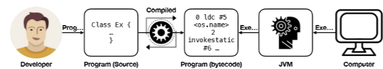

# OOP01

## 프로그램

- 프로그램은 일종의 명령서
  - 프로그래밍 : 사람이 명령서를 작성하는 과정
  - 프로그램 실행 : 컴퓨터가 명령서에 따라 명령을 수행하는 과정

## 사람과 컴퓨터는 서로 달라 서로 의사소통이 불가

- 사람은 자연어 사용, 컴퓨터는 기계어 사용

## 서로의 차이를 극복하는 방법

- 자연어를 알아듣는 컴퓨터를 만든다.
- 사람이 컴퓨터의 언어로 명령한다.
- **번역을 활용하여 언어의 차이를 극복**

## 사람이 작성한 명령서를 컴퓨터의 언어로 극복

- 사람이 고수준 언어로 프로그램을 작성
- 고수준 언어로 작성된 프로그램이 기계어 프로그램으로 번역
- 기계어로 번역된 프로그램을 컴퓨터가 그대로 이해하고 명령을 수행

## 컴파일

- 프로그램을 번역하는 과정
- 컴파일러는 프로그램을 번역하는 프로그램

## 해석을 활용하여 언어의 차이를 극복

- 사람이 작성한 명령서를 해석기를 활용하여 실행
- 사람이 고수준 언어로 프로그램을 작성
- 컴퓨터는 고수준 언어로 작성된 프로그램 대신 해석기를 실행
- 실행된 해석기가 고수준 언어로 작성된 프로그램을 이해하고 명령을 수행
- 따라서 명령서는 해석기라는 컴퓨터의 대리인을 통해 수행

## 해석

- 프로그램을 해석 & 실행하는 과정
- 인터프리터는 프로그램을 컴퓨터 대신 해석하는 프로그램

## 번역 vs 해석

- 컴파일러는 바이너리 프로그램을 생성한다. 따라서 느리다. 
- 인터프리터는 바이너리 프로그램을 만들지 않는다. 따라서 빠르다.

## 프로그래밍 언어란?

- 사람이 프로그램을 작성할 때 사용하는 언어
- Syntax와 Semantics로 구성
  - 구문구조(Syntax) : 프로그래밍 언어 구문의 생김새
  - 의미(Semantics) : 프로그래밍 언어 구문의 동작

## 번역 프로그래밍 언어

- 컴파일러에 의해 번역되는 프로그래밍 언어
- 번역 과정에서 다양한 안정성 검증 과정을 수행
  - Lexical & Syntax analysis, Semantics analyses
- 번역 과정에서 다양한 최적화 과정을 수행
  - Constant propagation, Dead-code elimination, Loop-unrolling
- 컴파일러의 안정성 검증을 통과해야 하므로 상대적으로 학습이 어렵고 자유도가 낮음
- 안정성 검증 및 최적화 수행으로 프로그램의 성능 및 안정성이 우수
- C/C++, Java, OCaml 등

## 해석 프로그래밍 언어

- 해석기에 의해 해석 & 실행되는 프로그래밍 언어
- 번역 과정이 없으므로 안정성 검증과 최적화를 수행하지 않음
  - 간단한 수준의 lexical & syntax analysis만 수행
  - 실행 도중 JIT(Just-In-Time) compilation 등을 통해 최적화를 수행하기도 함.
- 안정성 검증 과정이 없어 상대적으로 학습이 쉽고 자유도가 높음
- 오류 발생 시 탐지가 어렵고 해석기를 거쳐 실행되므로 성능이 상대적으로 낮음
- Python, JavaScript 등

## 프로그래밍 언어 패러다임

- 명령형 언어(Imperative Languages) : 프로그램의 상태를 변화시키는 서술(statement)을 순차적으로 수행하여 명령을 수행
- 절차지향형 언어(Procedural Languages) : 서술의 연속으로 구성되는 절차(procedure)를 정의하고 이를 통해 명령을 수행
- 함수형 언어(Functional Languages) : 입력과 출력의 매핑인 함수(function)의 조합과 적용으로 프로그램을 구성
- 객체지향 언어(Object-Oriented Languages) : 상태와 행동을 갖는 객체들의 관계로 프로그램을 구성

## Java

- Java는 대표적인 객체지향 프로그래밍 언어
- 1996년 Sun Microsystems에 의해 개발
- 다양한 형태의 가전제품에 탑재되는 소프트웨어 개발을 목표로 정의
- C++과 유사하나 배우고 활용하기 쉬움
- 순수 객체지향에 가까운 언어
- 자동 메모리 관리를 수행

## Java 프로그램 실행 개요

- Java는 번역 언어
- Java 프로그램은 컴파일러를 통해 Java bytecode로 번역
- Java bytecode는 Java 가상기계(Java Virtual Machine, JVM)에 의해 해석 & 실행
- Java bytecode는 JVM의 기계어

## 복잡하게 실행되는 이유

- 기계, 운영체제에 구애받지 않고 실행할 수 있도록 하기 위하여 Java bytecode를 해석할 수 있는 해석기를 각각 고용하여 프로그램을 해석(WORA)

## Lab

- Java 개발환경 구축
- Java 프로그램 작성
- Java 프로그램 컴파일
- Java 바이트코드 확인
- Java 프로그램 실행
- 프로그램 배포
- 통합 개발 환경의 사용
- IntelliJ 설치 & 프로젝트 생성 & 프로젝트 작성 & 프로젝트 실행
- 실행 가능한 Java Archive 만들기

