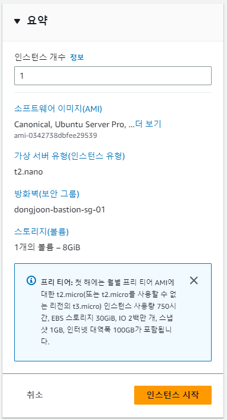
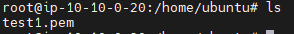

# AWS Hands-on

## Tag

- 리소스 관리를 위해 key-value 형식의 tag 부여
- aws는 모든 리소스에 대해 tag를 부여 가능(리소스 Name의 경우에도 Tag의 한 종류)
- 소유자, 작업자, 프로젝트 등 관리하고자 하는 분류 기준으로 Tag 부여
- 리소스 생성 시 입력하거나, 리소스 생성 후 변경
- 태그의 Key, Value를 기준으로 자동화 정책을 생성할 수 있으므로, 관리 관점에서 매우 유용

## IAM(Identity and Access Management)

- 정책과 권한 그룹을 통해 RBAC 기반의 액세스 제어
- AWS 제공 정책 또는 사용자 정의 정책을 IAM Group에 해당
- IAM User(또는 역할)에 권한 정책을 직접 적용하지 않고, IAM User(또는 역할)를 IAM Group에 맵핑하여 관리
- AWS 공식 가이드 : https://docs.aws.amazon.com/ko_kr/IAM/latest/UserGuide/introduction.htm

## 실습

### 목표 설계도

### VPC 생성

### Subnet 생성

- VPC는 자기 이름으로 검색
- Subnet 이름

|          |            AZ-c            |            AZ-a            |
|:--------:|:--------------------------:|:--------------------------:|
|   외부망    | dongjoon-ext-c-sbn-01 / 0  | dongjoon-ext-a-sbn-01 / 1  |
| 내부망(FE)  | dongjoon-int1-c-sbn-01 / 2 | dongjoon-int1-a-sbn-01 / 3 |
| 내부망(BE)  | dongjoon-int2-c-sbn-01 / 4 | dongjoon-int2-a-sbn-01 / 5 |
| 내부망(DB)  | dongjoon-data-c-sbn-01 / 6 | dongjoon-data-a-sbn-01 / 7 |

- 가용영역 쓰는 순서는 c - a - b - d 이다.
- CIDR은 `10.10.0.0/24` ~ `10.10.7.0/24`까지
- 태그에 `Owner` 반드시 붙일 것!

int2-a가 빠짐

생성 확인

### IGW 생성

### Routing Table 생성

VPC를 생성하면 기본적으로 주는 라우팅 테이블이 존재한다.(위 그림)

해당 라우팅 테이블에 이름과 소유자 태그를 설정해준다.

(라우팅 테이블을 서브넷마다 적용할 수 있다. 라우팅 테이블은 티어마다 설정해주는 것이 좋다.)

#### 외부용 라우팅 테이블

생성 후 서브넷을 연결 해준다.

#### 내부용 라우팅 테이블

생성 후 서브넷을 연결 해준다.

#### 생성 및 서브넷 연결 확인

#### 인터넷 게이트웨이 연결

인터넷 게이트웨이는 inbound / outbound 모두 받아준다.

### NAT Gateway 생성

NAT 게이트웨이는 내부망에서 나가는 outbound는 허용 O, 외부망에서 들어오는 inbound는 허용 X

#### 탄력적 IP 주소 이름 편집

#### 내부용 라우팅 테이블에 NAT Gateway 연결

### SG(Security Group) 생성

### Bastion EC2 생성

이름은 `dongjoon-bastion-ec2-01`

서버는 Ubuntu 20.04 LTS

인스턴스 유형은 제일 싼 t2.nano

인스턴스 시작

서버 생성 및 구동 및 IP 주소 확인

mobaxterm 구동

저장해뒀던 pem키를 이용하여 접속 username은 ubuntu

접속 완료

**만약 접속 안될 시**

네이버에서 내 아이피 찾아서 bastion 보안 그룹의 inbound 규칙에 찾은 IP 입력 후 다시 접속하면 됨.

### Bastion 서버 설정

sshd config 파일 열기

passwordauthentication yes로 변경

sshd 재시작

ubuntu 계정 비밀번호 설정

pem키를 bastion 서버에 전송

`scp .\test1.pem ubuntu@52.79.235.154:/home/ubuntu`

전송 받은거 확인

### 이중화 서버 생성

### 이중화 서버 설정

### ELB의 구조

### ELB의 종류와 기능

### Target Group 생성

### ALB 생성
