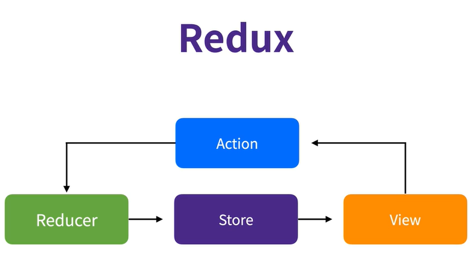

# Day 41

## Redux

- Prop Drilling 문제를 해결하기 위해 등장하였다.
- Context API는 React 내장 API이다.
- Thrid Party 라이브러리
- 미들웨어 기능 제공
- 성능 최적화 기능
- Context API와 useReducer를 함께 쓰는 것과 비슷하다.

- 하나의 Provider안에 모든 데이터가 기록된다.
- 진실은 하나의 근원으로부터
  - Context API는 변경이 발생하는 경우에 모든 consumer를 리렌더링하게 하지만 redux는 사용하는 부분만 리렌더링하도록 최적화하고 있다.
- 상태는 읽기 전용이다.
  - 상태에 접근하기 위해선 반드시 action이 필요하고 해당 action을 통해 상태가 변경되도록 해야 한다.
- 변화는 순수 함수로 작성되어야 한다.
  - reducer안에 네트워크 로직이 들어가서는 안된다.

## Redux를 활용한 