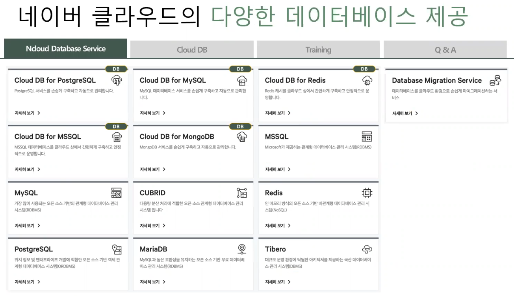

# Cloud03

# Cloud DB

## 소개

- Cloud DB란 OS와 DB를 일일히 설치하는 번거로움을 해소하기 위하여 등장하였다.

### 하이브리드 클라우드

private subnet은 on-premise로 구축하고 public subnet은 클라우드로 구축하여 보안과 접근 용이성을 모두 증대시킬 수 있는 클라우드 형태

### 멀티 클라우드

2개 이상의 클라우드 환경에 시스템을 구축하여 장애 상황에서도 서비스를 중단없이 제공하도록 고가용성을 확보한 클라우드 형태

### 서비스별 구분

PaaS : 잘 모르는 부분들은 클라우드사에서 제공하고 DBA들은 DB에 관련된 설정 및 구축만 진행하도록 할 수 있는 서비스를 제공한다.

### 네이버 클라우드에서 제공하는 DB 서비스들

### IaaS vs PaaS

|               | IaaS                                                          | PaaS                                                                                        |
|---------------|---------------------------------------------------------------|---------------------------------------------------------------------------------------------|
| 설치 및 최적화 설정   | • 엔지니어 역량에 따라 상이한 운영 상황                                       | • 간단한 입력과 클릭 몇 번이면 바로 서비스에 사용 가능한 데이터 베이스가 제공 • 네이버 서비스에서 오랜 시간 검증된 기본으로 빠르고 안정적인 운영 가능 |
| 장애 발생에 따른 가용성 | • Fail-over 클러스터 구성 별도 필요 • 장애 발생 시 빠른 대응 불가              | • 자동 Fail-over 기능을 독자적으로 개발하여 제공 • 장애 발생 시에도 안정적인 고객 서비스 제공이 가능                         |
| DB 백업 및 복원    | • 백업을 위한 별도 솔루션 및 기능 추가 필요 • 백업 용량에 따른 디스크 추가 구성 필요       | • 매일 자동으로 DB 백업이 진행되며 데이터는 최대 30일까지 보관 가능 • 최종 백업본 기준으로 자동 복구 또는 원하는 시점으로 DB 복원 가능      |
| 성능 모니터링 및 알람  | • 별도 모니터링 Tool 설치 필요 • E-Mail, Slack 등 알람은 가능하나 SMS 전달 불가 | • 수치 및 그래프 제공 • 장애 또는 사용자가 설정한 이벤트 발생 시 관리자의 메일 또는 SMS로 즉시 알람 전송                        |

## 상품

### Cloud DB for MySQL

장애가 발생하면 자동으로 복구하는 완전 관리형 클라우드 데이터베이스입니다. Cloud DB for MySQL은 네이버 서비스에서 검증된 최적화 설정을 통해 안정적으로 운영되며 MySQL 데이터베이스를 손쉽게 구축하고
운영할 수 있다.

#### 특징

- 6TB까지 스토리지 자동증가
  - 기본 10GB 데이터 스토리지를 제공(10GB 단위 증가)
  - 필요한 성능에 따라 HDD나 SSD 중 선택 가능
- DB 백업 및 복원
  - 매일 자동으로 DB 백업이 진행되며 데이터는 최대 30일까지만 보관
  - 최종 백업본 기준으로 자동 복구 또는 원하는 시점으로 DB 복원 가능
- 읽기 부하 분산 지원
  - 최대 10대까지 복제 슬레이브 DB 확장이 가능
  - Load Balancer 상품을 이용하여 데이터베이스 읽기 부하 분산 지원
- 성능 모니터링 및 알람
  - Slow Query, Read / Write QPS, Connections, CPU Usage, Load Average 등의 수치 및 그래프 제공
  - 장애 또는 사용자가 설정한 이벤트 발생 시 관리자의 메일 또는 SMS로 즉시 알람 전송

### Cloud DB for PostgreSQL

PostgreSQL 데이터베이스를 쉽고 간편하게 구축하고 관리할 수 있는 서비스로, 장애가 발생하면 자동으로 복 구하는 완전 관리형 클라우드 데이터베이스 서비스입니다. Cloud DB는 네이버 서비스에서 검증된
최적화 설 정을 통해 안정적으로 운영됩니다.
CRUD 쪽에서 MySQL보다 성능이 좋다.

#### 특징

- 6TB까지 스토리지 자동 증가
  - 기본 10GB 데이터 스토리지를 제공 (10GB 단위 증가)
  - 필요한 성능에 따라 HDD나 SSD 중 선택 가능
- DB 백업 및 복원
  - 매일 자동으로 DB 백업이 진행되며 데이터는 최대 30 일까지 보관
  - 최종 백업 본 기준으로 자동 복구 가능
- 읽기 부하 분산 지원
  - 최대 5대까지 Read Replica DB 확장이 가능하며, Load Balancer 상품을 이용하여 데이터베이스 읽기 부하 분산이 가능
- 성능 모니터링 및 알람
  - 설치 후 즉시 DB 모니터링을 이용할 수 있으며, PostgreSQL 데이 터베이스에서 발생하는 로그를 콘솔 웹 화면상에서 확인 가능
  - 장애 또는 이벤트 발생 시 사용자의 메일과 SMS로 빠르게 장애 현황 알림
- 장애 발생시 Fail-over 방법
  - 기본적으로 Primary DB와 Secondary DB를 생성
  - Primary DB 장애 시, Secondary DB로 자동 Fail-over
  - DNS 방식으로 이중화를 제공함으로써 어플리케이션 변경이 불필요

### Cloud DB for MSSQL

Cloud DB for MSSQL은 클라우드 상에서 MSSQL 데이터베이스를 손쉽게 구축하고 자동으로 관리할 수 있는 서비스입니다. 네이버 서비스에서 검증된 최적화 설정을 통해 안정적으로 운영되며, 장애가 발생하면
자동으로 복구하는 완전 관리형 클라우드 데이터베이스입니다.

#### 특징

- 2TB까지 스토리지 자동 증가
  - 100GB를 기본 제공하며, 10GB 단위로 2TB까지 자동 증가
  - 사용자가 필요한 I/O 속도에 따라 HDD, SSD 선택가능
- DB 백업 및 복원
  - 자동 백업이 진행되며 데이터는 최대 30일까지 보관 가능
  - 백업본 데이터로 원하는 시점으로 복원 가능하며, 새로운 MSSQL 서비스 생성이 가능
- 읽기 부하 분산 지원
  - batch processing(일괄처리) 및 Business Intelligence로 적합한 읽기 슬레이브 서버 최대 5개까지 생성 가능
- 성능 모니터링 및 알람
  - 설치 후, 즉시 MSSQL과 OS 모니터링이 가능하며, MSSQL 동작 상황을 그래프로 쉽게 확인 가능
  - 장애/이벤트 발생 시 사용자의 메일 및 SMS로 빠르게 장애 현황 알림

### Cloud DB for MongoDB

장애가 발생하면 자동으로 복구하는 완전 관리형 클라우드 데이터베이스 서비스로 Cloud DB for MongoDB는 네이버 서비스에서 검증된 최적화 설정을 통해 MongoDB 데이터베이스를 Shading과
Replica Set 방식으로 선택하여 손쉽게 구축하고 안정적으로 운영할 수 있습니다.

#### 특징

- 2TB까지 스토리지 자동 증가
  - 기본 50GB 데이터 스토리지를 제공(10GB 단위 증가)
  - 필요한 성능에 따라 HDD나 SSD 중 선택 가능
- DB 백업 및 복원
  - 매일 자동으로 DB 백업이 진행되며 데이터는 최대 30일까지 보관
  - 최종 백업본 기준으로 자동 복구 또는 원하는 시점으로 DB복원 가능
- 읽기 부하 분산 지원
  - 최대 7대까지 Replica Set 확장이 가능
  - MongoDB의 Read Preference 옵션을 사용하여 데이터베이스 읽기 부하 분산 지원
- 성능 모니터링 및 알람
  - 설치 후 즉시 DB 모니터링이 가능하며, 발생되는 로그를 콘솔 웹화면에서 손쉽게 확인 가능
  - 장애 또는 사용자가 설정한 이벤트 발생 시 관리자의 메일 또는 SMS로 즉시 알람 전송
- 장애 발생 시 Fail-over 방법
  - MongoDB Replica Set에서의 자체적인 primary term 방식을 사용하여 Fail-over 기능을 제공

### Cloud DB for Redis

장애 발생 시 자동 복구를 통해 안정적으로 운영되는 완전 관리형 클라우드 인메모리 캐시 서비스로, Cloud DB for Redis는 클라우드 상에서 Redis 캐시를 손쉽게 구축하고 관리할 수 있습니다.

#### 특징

- Cluster 및 Auto Sharding 지원
  - 동일 스펙으로 최소 3개 ~ 최대 10개까지 구성 가능
  - 각 Shard 당 Slave Node 구성은 최대 4개까지 구성 가능
- 확장성
  - 노드추가를 통해서 Redis Cluster를 확장 가능
  - 많은 트래픽을 처리하여 서비스에 맞는 유연한 대처 가능
- 자동 Fail-over를 통한 탁월한 가용성 제공
  - 자동 Fail-over 기능을 제공하여 장애 발생 시에도 안정적인 고객 서비스 제공이 가능
- 성능 모니터링 및 알람
  - 설치 후 즉시 Redis와 OS 모니터링 이용을 통해 Redis의 동작상황을 그래프로 손쉽게 확인 가능
  - 장애 또는 사용자가 설정한 이벤트 발생 시 관리자의 메일 또는 SMS로 즉시 알람 전송
- 장애 발생 시 Fail-over 방법
  - Redis Cluster 상품은 각 노드들의 ping check를 통해서 장애를 감지
  - 복구시 Slave를 cluster로 투입

### Cloud DB for MySQL Lab

1. Cloud DB for MySQL 서비스 신청
2. Cloud DB for MySQL 접속(MySQL Workbench 이용)
3. Cloud DB for MySQL 백업하기
4. Cloud DB for MySQL 복원하기
5. Fail-over 테스트

## Application Service

### 네이버 클라우드 플랫폼 Application Service에서 제공하는 서비스들

### Maps

최고 수준의 지도 서비스를 제공하는 네이버 지도 API

#### 특징

- 신뢰할 수 있는 데이터
- 국내 No.1 지도 서비스
- 다양한 위치기반 서비스 제공

### CAPTCHA

네이버 회원가입 및 로그인 어뷰징과 동일한 CAPTCHA 서비스 제공

#### 제공 서비스

| 상품명                               | 상품설명                                                                                                  |
|-----------------------------------|-------------------------------------------------------------------------------------------------------|
| 이미지 방식의 질문 제공 (Image CAPTCHA) | 자동 입력 방지를 위해 컬러와 흑백으로 두 종류의 캡차 이미지가 임의의 확률로 제공됩니다. 이용자가 제공된 이미지에 기재된 글자를 인식하여 입력하면, 그 결과로 어뷰징을 검증합니다. |
| 오디오 방식의 질문 제공 (Audio CAPTCHA) | 자동 입력 방지를 위해 숫자가 포함된 음성 메세지가 약 5초간 제공됩니다. 이용자가 제공된 오디오에 포함된 숫자를 인식하여 입력하면, 그 결과로 어뷰징을 검증합니다.          |
| RESTful API 방식으로 서비스 제공           | 쉽고 편리한 이용을 위해 RESTful 방식으로 API를 제공합니다. 좌표를 통해 주소 정보(법정동, 행정동, 지번주소, 도로명주소 등)을 반환                      |

#### API 이용

비로그인 오픈 API이므로 GET으로 호출할 때 HTTP Header에 어플리케이션 등록 시 발급받은 Client ID와 Client Secret 값을 같이 전송해서 활용 가능

### Simple & Easy Notification Service(SENS)

#### 제공서비스

| 항목                   | 내용                                                               |
|----------------------|------------------------------------------------------------------|
| SMS                  | SMS/LMS 서비스를 연동 정보 등록/관리, 전송 이력 검색 조회                            |
| MMS                  | 이미지, 사진, 그림 등의 멀티미디어 첨부 메세지 전송                                   |
| PUSH                 | APNS,G(F)CM Push 서비스 연동을 위한 인증서 등록/관리                            |
| 국제 SMS               | 국외 SMS 발송 가능 (대만, 일본, 중국, 싱가포르, 홍콩, 미국, 캐나다)                     |
| 080 수신거부 번호          | 광고 메세지 발송 시 관련 법령에 따른 수신거부 방법 표기 기능 제공                           |
| 카카오톡 비즈메시지 (알림톡) | 카카오 채널 친구 추가 고객에게만 메세지 발송 기능 제공                                  |
| Development API 제공   | 프로젝트를 생성하고 인증서를 등록하면 실제 서비스 코드에 적용할 수 있는 Development API 가이드를 제공 |

#### 특징

- 효율적인 프로젝트 관리
- 친절한 API 사용 가이드 제공
- 직관적인 대시보드 제공
- 다양한 메세지 전송 방법 제공

### API Gateway

#### 제공 서비스

- Product 관리
  - 여러 API 묶음의 Product 별로 호출 도메인 제공
  - Product의 API Key를 통해 사용자 어플리케이션 식별 가능 및 사용량 제한
- API 관리 및 Key 관리
  - REST API의 리소스와 메서드를 정의하고 인증방식 설정
  - API 버전 관리 기능 및 API Key 발급 및 관리 기능 제공
  - Throttling 정책, IP ACL 등의 설정 관리가 가능

#### 특징

- 유연한 API 관리
- 백엔드 서비스의 트래픽 제어
- 안전한 API 사용자 인증
- API 사용량 모니터링 대시보드 제공

### nShortURL

#### 제공 서비스

입력된 URL을 me2.do 형태의 짧은 URL로 변환해주는 REST API입니다.

#### 특징

- 안전한 단축 URL 생성
- 손쉬운 사용
- 다양한 부가 기능 제공

### SearchTrend

#### 제공 서비스

네이버에서 발생되는 검색 로그를 통해 주요 이슈에 대한 관심 수준과 추이를 조회하여 사업 정책을 수립하거나 마케팅 계획을 세우는 등 다양한 분야에 활용된다.
검색어, 조회 기간, 연령, 성별, 검색 디바이스(PC/모바일)을 선택하여 RESTfull API 방식으로 전달하면 해당 기준의 통계 결과를 상대적 비율로 리턴해주는 API 제공

#### 특징

- 신뢰할 수 있는 통계 분석
- 다양하고 세분화된 측면에서의 분석
- 손쉬운 사용

### Cloud Outbound Mailer

#### 제공 서비스

- 대량 및 예약 메일 전송 기능
- 주소록 기능을 활용한 수신자 목록 관리
- 템플릿을 활용한 콘텐츠 관리 기능
- 직관적인 통계 제공

#### 특징

- 대용량 및 예약 메일 전송 기능
- 콘텐츠 개인화
- 직관적인 통계 제공
- 수신자 그룹 관리 및 조합 발송

#### Application Service Lab

1. Search Trend / nShortURL 실습
2. Cloud Outbound Mailer 실습

## AI Service

### 네이버 클라우드 플랫폼에서 제공하는 AI Service 들

### CLOVA Speech Recognition

#### 서비스 개요

음성 데이터를 API를 통해 CLOVA Speech Recognition(CSR) 엔진에 전송하여, 해당 음성 데이터를 인식해서 텍스트로 변환하여 전달

#### API 이용

- CSR 모바일 SDK를 이용한 어플리케이션 API 인증을 위해 Client ID와 애플리케이션의 개발 패키지 이름을 이용
- REST API는 Client ID와 Client Secret을 이용하여 인증
- 인증부터 API 이용까지 데이터 전송 구간은 모두 암호화를 적용

#### 활용 사례

- 서비스를 음성으로 컨트롤하는데 활용
- 가전 제품 및 공동 주택의 홈 네트워크 제어, 배달 주문, 금융 서비스 등에 적용 가능
- 비서 서비스 등을 구현하는데 이용
- REST API를 이용하면 축적된 음성 데이터 파일을 텍스트로 변환하는데 활용

#### 특징

- 높은 인식률 및 다양한 언어 지원
- 학습을 통해 높아지는 성능
- 손쉬운 사용

### CLOVA Voice

#### 주요 기능

- 고품질 음성 합성 기술
- 자연스러운 억양과 감정 표현
- 다양한 컨텐츠 표현에 최적화

#### 목소리

음성합성음 제공 내역 - 총 85종

#### 특징

- 음성기반 합성 기술 적용
- 자연스러운 표현 기술
- 다양한 환경 지원

### CLOVA Green-Eye

#### 서비스 개요

- 인터넷 및 모바일 환경에 등록된 유해 컨텐츠의 신속한 식별 제공
- 전송된 모든 이미지를 이미지 단위로 검사하고 유해 컨텐츠 등급에 따라 검사 결과 값 반환

#### 주요 기능

- 유해 컨텐츠 등급 분류

#### 특징

- 뛰어난 정확도
- 컨텐츠 품질 향상
- 안정적인 서비스 제공

### CLOVA Dubbing

#### 지원 보이스

#### 지원 서비스

#### 특징

- 다양한 보이스
- 섬세한 더빙 커스터마이징
- 쉬운 더빙 편집
- 다양한 보이스와 효과음 선택

### CLOVA OCR

#### 서비스 개요

이미지에서 글자들을 추출해주는 서비스

#### 특징

- 정확한 데이터 추출
- 세계 최고 수준의 인식 정확도

### AI Service Lab

1. CLOVA Voice 실습
