# Cloud04

# Monitoring
  - [Management](#management)
  - [Monitoring](#monitoring)
  - [Cloud Insight](#cloud-insight)
  - [Network Traffic Monitoring](#network-traffic-monitoring)
  - [Web Service Monitoring system](#web-service-monitoring-system)
  - [Sub Account](#sub-account)
  - [Cloud Activity Tracer](#cloud-activity-tracer)
  - [Resource Manager](#resource-manager)
  - [Cloud Advisor](#cloud-advisor)
  - [Lab](#lab)

## 모니터링

---

### Management

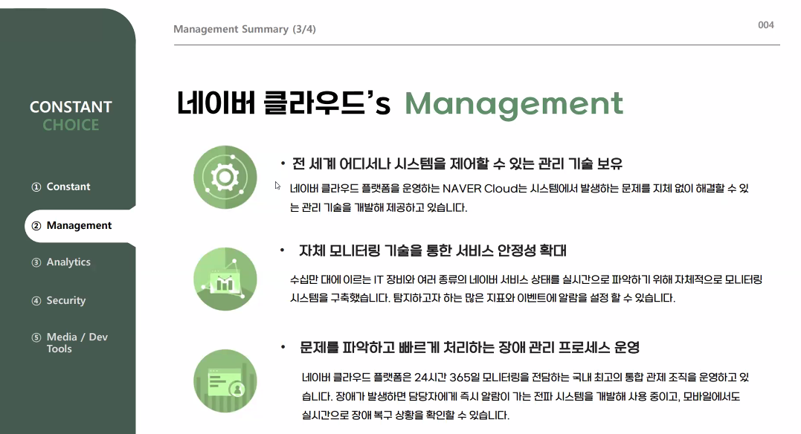

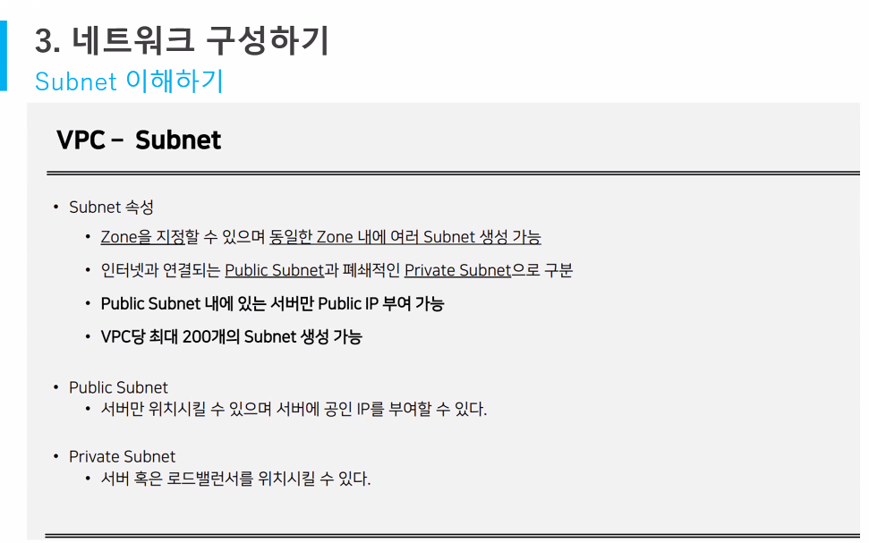

### Monitoring

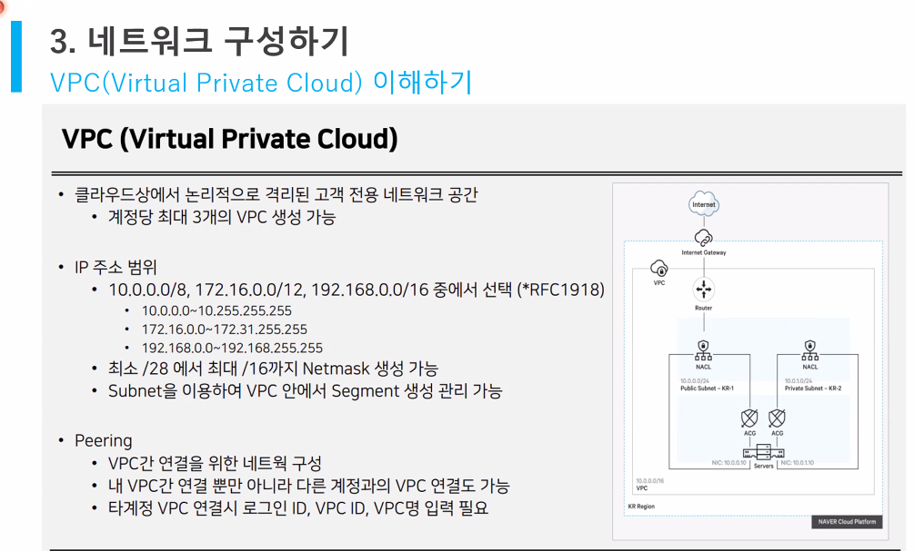

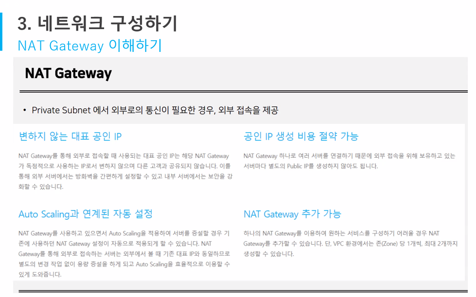

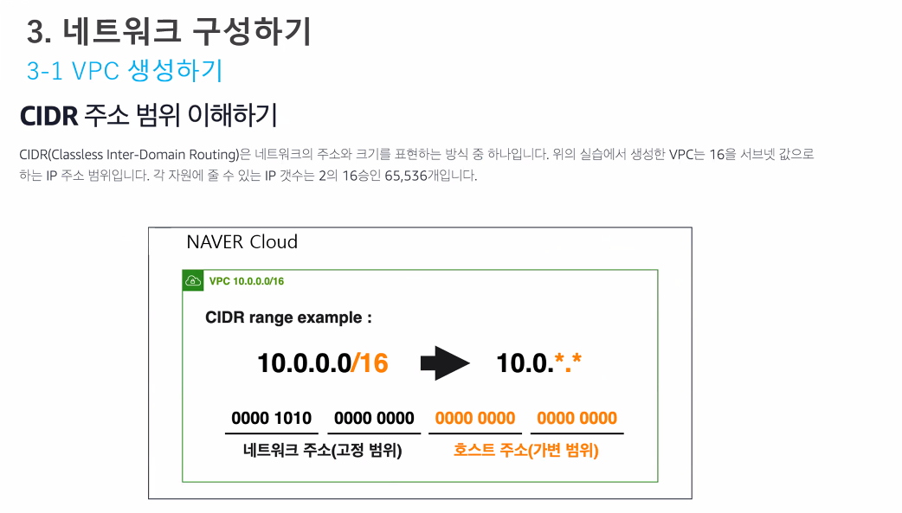

### Cloud Insight

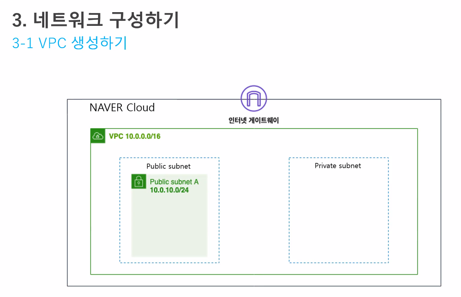

- 모니터링보다 업그레이드된 기능
- vpc에서 활용할 수 있는 모니터링 기능

### Network Traffic Monitoring

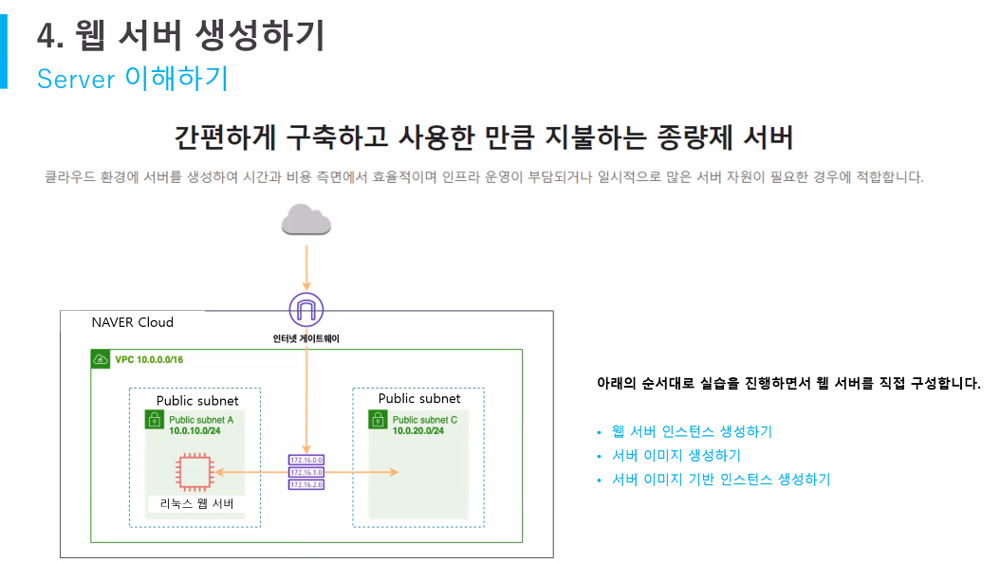

- 무료
- region간 트래픽, 속도 확인 가능
- vpc public간의 private 트래픽 확인 가능

### Web Service Monitoring System

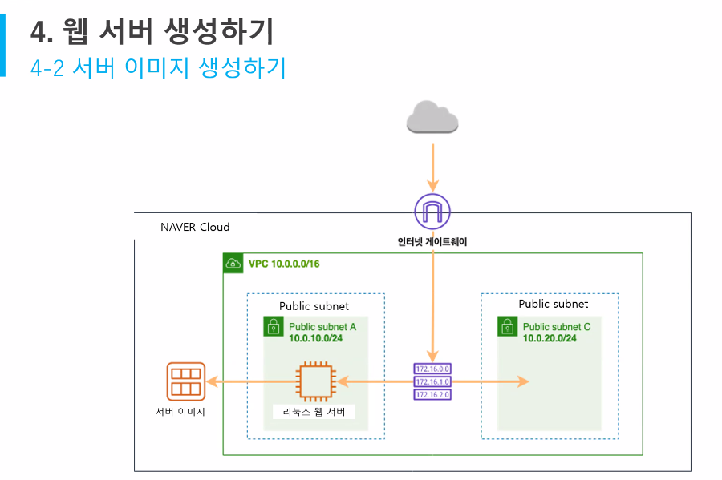

- 에이전트 설치없이 모니터링 가능

### Sub Account

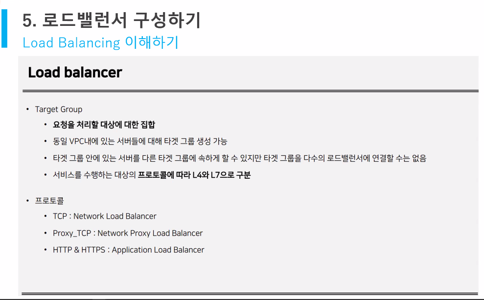

### Cloud Activity Tracer

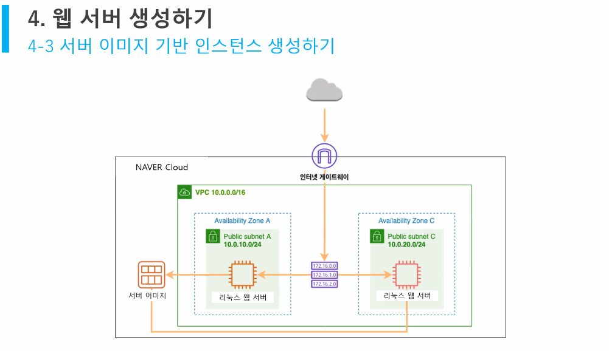

- 90일간의 모든 콘솔 작업을 기록한다.
- 90일 이후의 로그들은 object storage로 저장된다.

### Resource Manager

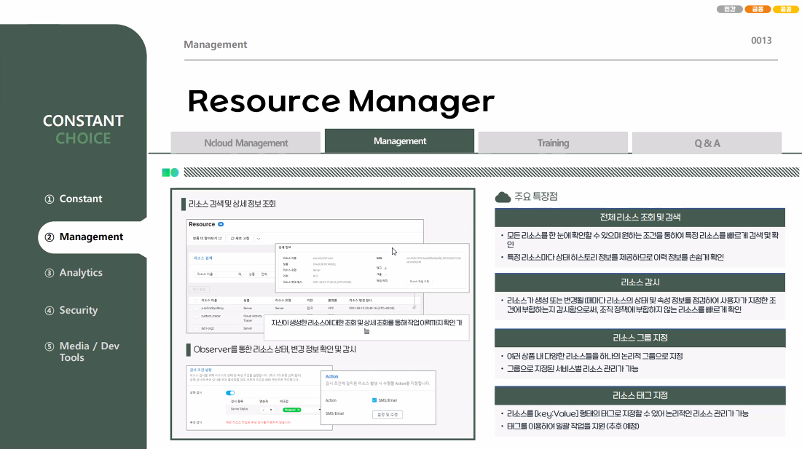

### Cloud Advisor

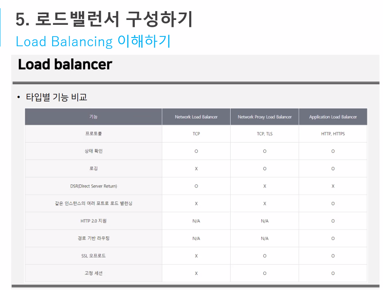

### Lab

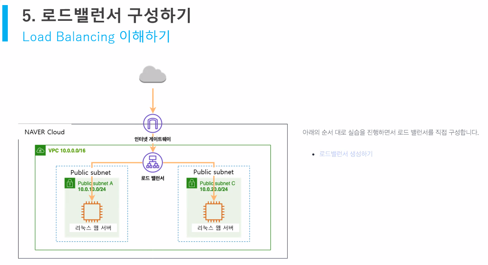